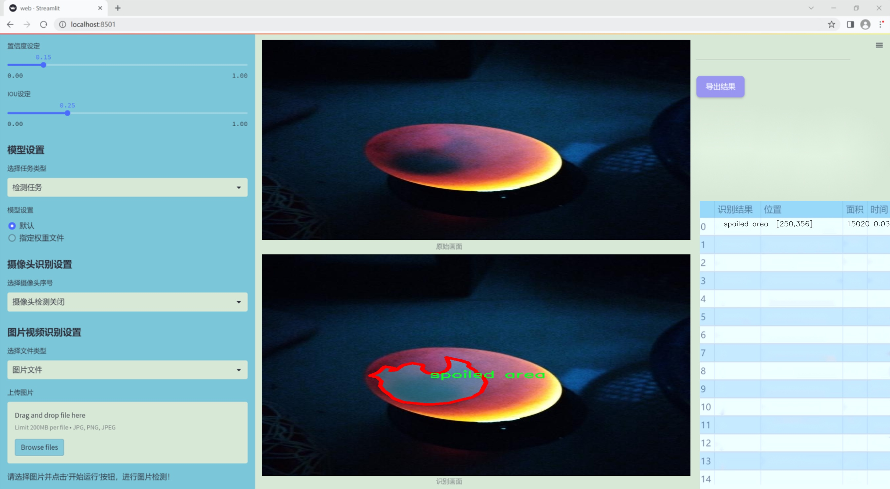
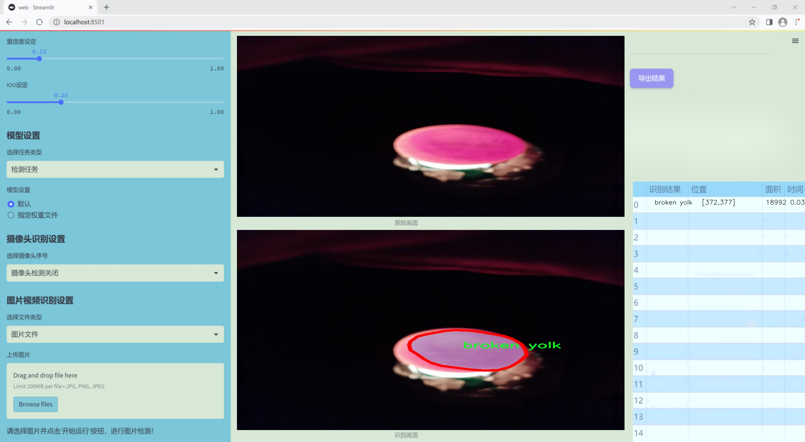
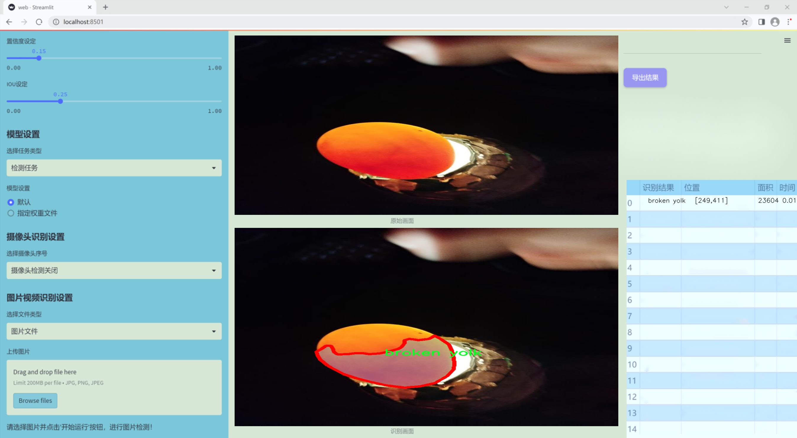
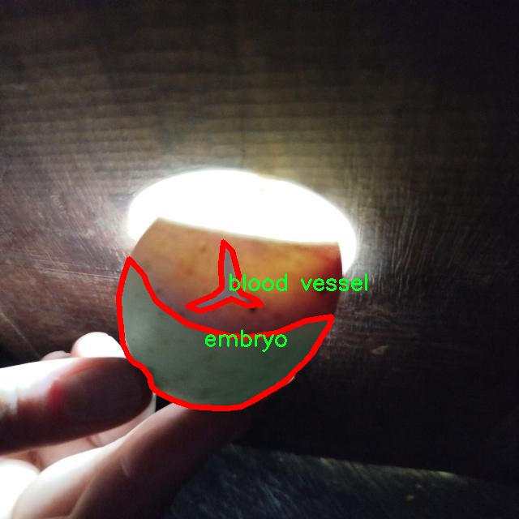
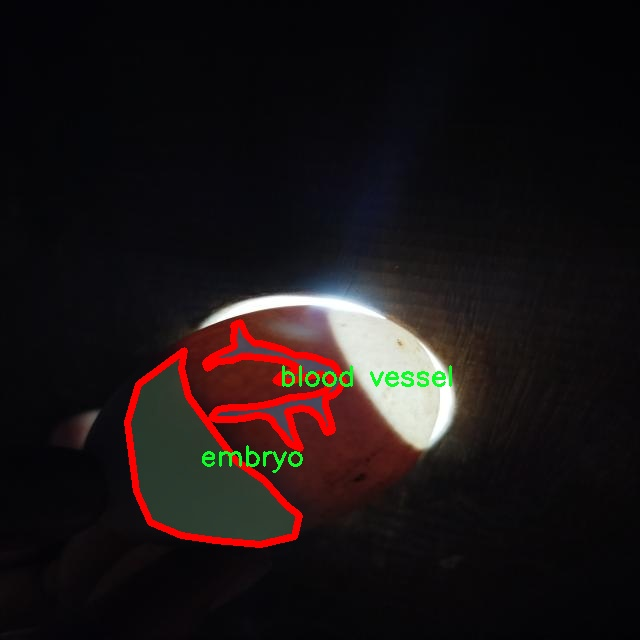
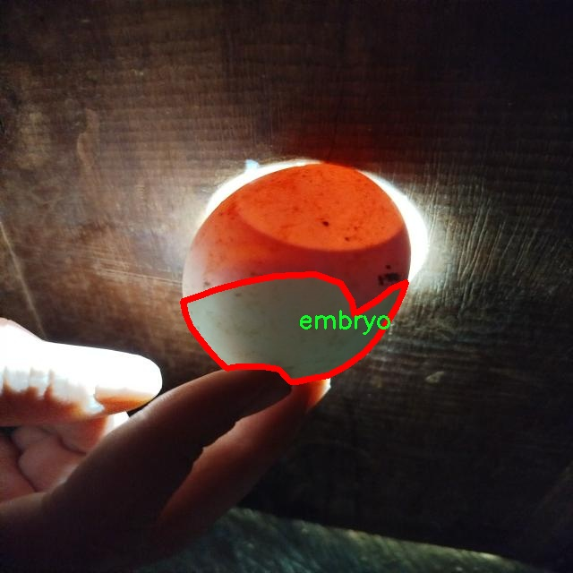
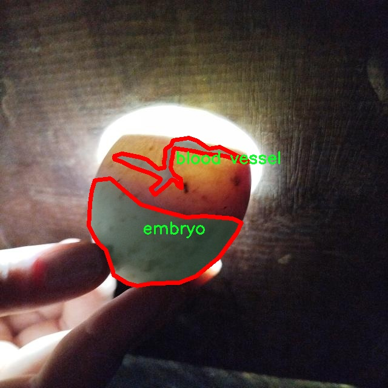
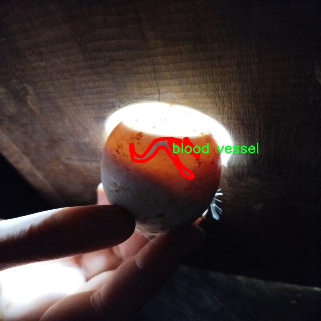

### 1.背景意义

研究背景与意义

在现代农业和生物技术领域，鸡蛋胚胎的健康发育直接关系到家禽养殖的经济效益和食品安全。随着科技的进步，计算机视觉技术在生物医学和农业中的应用日益广泛，尤其是在胚胎发育异常检测方面。传统的人工检测方法不仅耗时耗力，而且容易受到人为因素的影响，导致检测结果的准确性和一致性不足。因此，开发一种高效、准确的自动化检测系统显得尤为重要。

基于改进YOLOv11的鸡蛋胚胎发育异常检测系统，旨在利用深度学习技术对鸡蛋胚胎进行实时监测和分析。YOLO（You Only Look Once）系列模型以其快速的检测速度和高精度的特性，成为目标检测领域的热门选择。通过对YOLOv11进行改进，可以进一步提升其在复杂环境下的检测能力，尤其是在处理不同类型的胚胎异常时，如血管异常、破损、变质等。

本研究所使用的数据集包含1500张经过精细标注的鸡蛋图像，涵盖了包括血管、破损、胚胎等在内的多个类别。这些类别的细致划分为模型的训练和评估提供了丰富的基础，能够有效提高模型对不同异常情况的识别能力。此外，数据集的多样性和丰富性为模型的泛化能力提供了保障，使其能够适应不同的实际应用场景。

通过构建这一检测系统，不仅可以提高鸡蛋胚胎发育异常的检测效率，还能为家禽养殖业提供科学依据，促进养殖管理的智能化和精细化。这一研究的成功实施，将为相关领域的研究提供新的思路和方法，推动农业科技的进步与发展。

### 2.视频效果

[2.1 视频效果](https://www.bilibili.com/video/BV1uUqqYxEDn/)

### 3.图片效果







##### [项目涉及的源码数据来源链接](https://kdocs.cn/l/cszuIiCKVNis)**

注意：本项目提供训练的数据集和训练教程,由于版本持续更新,暂不提供权重文件（best.pt）,请按照6.训练教程进行训练后实现上图演示的效果。

### 4.数据集信息

##### 4.1 本项目数据集类别数＆类别名

nc: 8
names: ['blood vessel', 'break', 'broken yolk', 'chamber', 'crack', 'egg', 'embryo', 'spoiled area']


该项目为【图像分割】数据集，请在【训练教程和Web端加载模型教程（第三步）】这一步的时候按照【图像分割】部分的教程来训练

##### 4.2 本项目数据集信息介绍

本项目数据集信息介绍

本项目旨在改进YOLOv11模型，以实现对鸡蛋胚胎发育异常的高效检测。为此，我们构建了一个专门的数据集，命名为“CVR EGG”，该数据集包含了多种与鸡蛋胚胎发育相关的异常特征，旨在为模型训练提供丰富的样本和多样化的场景。数据集中共包含8个类别，分别为“血管”、“破损”、“破裂的蛋黄”、“腔室”、“裂纹”、“鸡蛋”、“胚胎”和“变质区域”。这些类别涵盖了鸡蛋胚胎发育过程中可能出现的各种异常情况，能够有效帮助模型学习识别和分类不同类型的发育问题。

在数据收集过程中，我们确保了样本的多样性和代表性，以便于模型在实际应用中具备更强的泛化能力。每个类别的样本均经过精心标注，确保标注的准确性和一致性，从而为后续的模型训练提供可靠的数据基础。通过对不同类别的特征进行深入分析，我们希望能够帮助模型更好地理解和识别鸡蛋胚胎的正常与异常状态，进而提高检测的准确率和效率。

此外，数据集中的样本涵盖了不同生长阶段的鸡蛋胚胎，反映了其在不同发育阶段可能出现的各种异常情况。这种时间维度的多样性将有助于模型学习到更复杂的特征，提升其在实际应用中的表现。我们相信，通过对“CVR EGG”数据集的深入研究和应用，能够为鸡蛋胚胎发育异常检测提供强有力的技术支持，推动相关领域的研究和实践进展。











### 5.全套项目环境部署视频教程（零基础手把手教学）

[5.1 所需软件PyCharm和Anaconda安装教程（第一步）](https://www.bilibili.com/video/BV1BoC1YCEKi/?spm_id_from=333.999.0.0&vd_source=bc9aec86d164b67a7004b996143742dc)


[5.2 安装Python虚拟环境创建和依赖库安装视频教程（第二步）](https://www.bilibili.com/video/BV1ZoC1YCEBw?spm_id_from=333.788.videopod.sections&vd_source=bc9aec86d164b67a7004b996143742dc)

### 6.改进YOLOv11训练教程和Web_UI前端加载模型教程（零基础手把手教学）

[6.1 改进YOLOv11训练教程和Web_UI前端加载模型教程（第三步）](https://www.bilibili.com/video/BV1BoC1YCEhR?spm_id_from=333.788.videopod.sections&vd_source=bc9aec86d164b67a7004b996143742dc)


按照上面的训练视频教程链接加载项目提供的数据集，运行train.py即可开始训练



     Epoch   gpu_mem       box       obj       cls    labels  img_size
     1/200     20.8G   0.01576   0.01955  0.007536        22      1280: 100%|██████████| 849/849 [14:42<00:00,  1.04s/it]
               Class     Images     Labels          P          R     mAP@.5 mAP@.5:.95: 100%|██████████| 213/213 [01:14<00:00,  2.87it/s]
                 all       3395      17314      0.994      0.957      0.0957      0.0843

     Epoch   gpu_mem       box       obj       cls    labels  img_size
     2/200     20.8G   0.01578   0.01923  0.007006        22      1280: 100%|██████████| 849/849 [14:44<00:00,  1.04s/it]
               Class     Images     Labels          P          R     mAP@.5 mAP@.5:.95: 100%|██████████| 213/213 [01:12<00:00,  2.95it/s]
                 all       3395      17314      0.996      0.956      0.0957      0.0845

     Epoch   gpu_mem       box       obj       cls    labels  img_size
     3/200     20.8G   0.01561    0.0191  0.006895        27      1280: 100%|██████████| 849/849 [10:56<00:00,  1.29it/s]
               Class     Images     Labels          P          R     mAP@.5 mAP@.5:.95: 100%|███████   | 187/213 [00:52<00:00,  4.04it/s]
                 all       3395      17314      0.996      0.957      0.0957      0.0845


###### [项目数据集下载链接](https://kdocs.cn/l/cszuIiCKVNis)

### 7.原始YOLOv11算法讲解

YOLOv11是Ultralytics推出的YOLO系列最新版本，专为实现尖端的物体检测而设计。其架构和训练方法上进行了重大改进，使之不仅具备卓越的准确性和处理速度，还在计算效率上实现了一场革命。得益于其改进的主干和颈部架构，YOLOv11在特征提取和处理复杂任务时表现更加出色。在2024年9月27日，Ultralytics通过长达九小时的在线直播发布这一新作，展示了其在计算机视觉领域的革新。

YOLOv11通过精细的架构设计和优化训练流程，在保持高精度的同时，缩减了参数量，与YOLOv8m相比减少了22%的参数，使其在COCO数据集上的平均准确度（mAP）有所提升。这种效率的提高使YOLOv11非常适合部署在各种硬件环境中，包括边缘设备、云计算平台以及支持NVIDIA GPU的系统，确保在灵活性上的优势。

该模型支持广泛的任务，从对象检测、实例分割到图像分类、姿态估计和定向对象检测（OBB），几乎覆盖了计算机视觉的所有主要挑战。其创新的C3k2和C2PSA模块提升了网络深度和注意力机制的应用，提高了特征提取的效率和效果。同时，YOLOv11的改进网络结构也使之在复杂视觉任务上得以从容应对，成为各类计算机视觉任务的多功能选择。这些特性令YOLOv11在实施实时物体检测的各个领域中表现出众。
* * *

2024年9月27日，Ultralytics在线直播长达九小时，为YOLO11召开“发布会”

YOLO11 是 Ultralytics YOLO 系列实时物体检测器的最新版本，它以尖端的准确性、速度和效率重新定义了可能性。在之前 YOLO
版本的显著进步的基础上，YOLO11 在架构和训练方法方面进行了重大改进，使其成为各种计算机视觉任务的多功能选择。


##### YOLO11主要特点：

  * 增强的特征提取：YOLO11 采用了改进的主干和颈部架构，增强了特征提取能力，可实现更精确的对象检测和复杂任务性能。
  * 针对效率和速度进行了优化：YOLO11 引入了完善的架构设计和优化的训练流程，可提供更快的处理速度，并在准确度和性能之间保持最佳平衡。
  * 更少的参数，更高的准确度：借助模型设计的进步，YOLO11m 在 COCO 数据集上实现了更高的平均准确度 (mAP)，同时使用的参数比 YOLOv8m 少 22%，从而提高了计算效率，同时又不影响准确度。
  * 跨环境的适应性：YOLO11 可以无缝部署在各种环境中，包括边缘设备、云平台和支持 NVIDIA GPU 的系统，从而确保最大的灵活性。
  * 支持的任务范围广泛：无论是对象检测、实例分割、图像分类、姿势估计还是定向对象检测 (OBB)，YOLO11 都旨在满足各种计算机视觉挑战。

##### 支持的任务和模式

YOLO11 以 YOLOv8 中引入的多功能模型系列为基础，为各种计算机视觉任务提供增强的支持：

Model| Filenames| Task| Inference| Validation| Training| Export  
---|---|---|---|---|---|---  
YOLO11| yolol11n.pt, yolol11s.pt, yolol11m.pt, yolol11x.pt| Detection| ✅| ✅|
✅| ✅  
YOLO11-seg| yolol11n-seg.pt, yolol11s-seg.pt, yolol11m-seg.pt,
yolol11x-seg.pt| Instance Segmentation| ✅| ✅| ✅| ✅  
YOLO11-pose| yolol11n-pose.pt, yolol11s-pose.pt, yolol11m-pose.pt,
yolol11x-pose.pt| Pose/Keypoints| ✅| ✅| ✅| ✅  
YOLO11-obb| yolol11n-obb.pt, yolol11s-obb.pt, yolol11m-obb.pt,
yolol11x-obb.pt| Oriented Detection| ✅| ✅| ✅| ✅  
YOLO11-cls| yolol11n-cls.pt, yolol11s-cls.pt, yolol11m-cls.pt,
yolol11x-cls.pt| Classification| ✅| ✅| ✅| ✅  
  
##### 简单的 YOLO11 训练和推理示例

以下示例适用于用于对象检测的 YOLO11 Detect 模型。

    
    
    from ultralytics import YOLO
    
    # Load a model
    model = YOLO("yolo11n.pt")
    
    # Train the model
    train_results = model.train(
        data="coco8.yaml",  # path to dataset YAML
        epochs=100,  # number of training epochs
        imgsz=640,  # training image size
        device="cpu",  # device to run on, i.e. device=0 or device=0,1,2,3 or device=cpu
    )
    
    # Evaluate model performance on the validation set
    metrics = model.val()
    
    # Perform object detection on an image
    results = model("path/to/image.jpg")
    results[0].show()
    
    # Export the model to ONNX format
    path = model.export(format="onnx")  # return path to exported model

##### 支持部署于边缘设备

YOLO11 专为适应各种环境而设计，包括边缘设备。其优化的架构和高效的处理能力使其适合部署在边缘设备、云平台和支持 NVIDIA GPU
的系统上。这种灵活性确保 YOLO11 可用于各种应用，从移动设备上的实时检测到云环境中的复杂分割任务。有关部署选项的更多详细信息，请参阅导出文档。

##### YOLOv11 yaml文件

    
    
    # Ultralytics YOLO 🚀, AGPL-3.0 license
    # YOLO11 object detection model with P3-P5 outputs. For Usage examples see https://docs.ultralytics.com/tasks/detect
    
    # Parameters
    nc: 80 # number of classes
    scales: # model compound scaling constants, i.e. 'model=yolo11n.yaml' will call yolo11.yaml with scale 'n'
      # [depth, width, max_channels]
      n: [0.50, 0.25, 1024] # summary: 319 layers, 2624080 parameters, 2624064 gradients, 6.6 GFLOPs
      s: [0.50, 0.50, 1024] # summary: 319 layers, 9458752 parameters, 9458736 gradients, 21.7 GFLOPs
      m: [0.50, 1.00, 512] # summary: 409 layers, 20114688 parameters, 20114672 gradients, 68.5 GFLOPs
      l: [1.00, 1.00, 512] # summary: 631 layers, 25372160 parameters, 25372144 gradients, 87.6 GFLOPs
      x: [1.00, 1.50, 512] # summary: 631 layers, 56966176 parameters, 56966160 gradients, 196.0 GFLOPs
    
    # YOLO11n backbone
    backbone:
      # [from, repeats, module, args]
      - [-1, 1, Conv, [64, 3, 2]] # 0-P1/2
      - [-1, 1, Conv, [128, 3, 2]] # 1-P2/4
      - [-1, 2, C3k2, [256, False, 0.25]]
      - [-1, 1, Conv, [256, 3, 2]] # 3-P3/8
      - [-1, 2, C3k2, [512, False, 0.25]]
      - [-1, 1, Conv, [512, 3, 2]] # 5-P4/16
      - [-1, 2, C3k2, [512, True]]
      - [-1, 1, Conv, [1024, 3, 2]] # 7-P5/32
      - [-1, 2, C3k2, [1024, True]]
      - [-1, 1, SPPF, [1024, 5]] # 9
      - [-1, 2, C2PSA, [1024]] # 10
    
    # YOLO11n head
    head:
      - [-1, 1, nn.Upsample, [None, 2, "nearest"]]
      - [[-1, 6], 1, Concat, [1]] # cat backbone P4
      - [-1, 2, C3k2, [512, False]] # 13
    
      - [-1, 1, nn.Upsample, [None, 2, "nearest"]]
      - [[-1, 4], 1, Concat, [1]] # cat backbone P3
      - [-1, 2, C3k2, [256, False]] # 16 (P3/8-small)
    
      - [-1, 1, Conv, [256, 3, 2]]
      - [[-1, 13], 1, Concat, [1]] # cat head P4
      - [-1, 2, C3k2, [512, False]] # 19 (P4/16-medium)
    
      - [-1, 1, Conv, [512, 3, 2]]
      - [[-1, 10], 1, Concat, [1]] # cat head P5
      - [-1, 2, C3k2, [1024, True]] # 22 (P5/32-large)
    
      - [[16, 19, 22], 1, Detect, [nc]] # Detect(P3, P4, P5)
    

**YOLO11和YOLOv8 yaml文件的区别**


##### 改进模块代码

  * C3k2 

    
    
    class C3k2(C2f):
        """Faster Implementation of CSP Bottleneck with 2 convolutions."""
    
        def __init__(self, c1, c2, n=1, c3k=False, e=0.5, g=1, shortcut=True):
            """Initializes the C3k2 module, a faster CSP Bottleneck with 2 convolutions and optional C3k blocks."""
            super().__init__(c1, c2, n, shortcut, g, e)
            self.m = nn.ModuleList(
                C3k(self.c, self.c, 2, shortcut, g) if c3k else Bottleneck(self.c, self.c, shortcut, g) for _ in range(n)
            )

C3k2，它是具有两个卷积的CSP（Partial Cross Stage）瓶颈架构的更快实现。

**类继承：**

  * `C3k2`继承自类`C2f`。这表明`C2f`很可能实现了经过修改的基本CSP结构，而`C3k2`进一步优化或修改了此结构。

**构造函数（`__init__`）：**

  * `c1`：输入通道。

  * `c2`：输出通道。

  * `n`：瓶颈层数（默认为1）。

  * `c3k`：一个布尔标志，确定是否使用`C3k`块或常规`Bottleneck`块。

  * `e`：扩展比率，控制隐藏层的宽度（默认为0.5）。

  * `g`：分组卷积的组归一化参数或组数（默认值为 1）。

  * `shortcut`：一个布尔值，用于确定是否在网络中包含快捷方式连接（默认值为 `True`）。

**初始化：**

  * `super().__init__(c1, c2, n, short-cut, g, e)` 调用父类 `C2f` 的构造函数，初始化标准 CSP 组件，如通道数、快捷方式、组等。

**模块列表（`self.m`）：**

  * `nn.ModuleList` 存储 `C3k` 或 `Bottleneck` 模块，具体取决于 `c3k` 的值。

  * 如果 `c3k` 为 `True`，它会初始化 `C3k` 模块。`C3k` 模块接收以下参数：

  * `self.c`：通道数（源自 `C2f`）。

  * `2`：这表示在 `C3k` 块内使用了两个卷积层。

  * `shortcut` 和 `g`：从 `C3k2` 构造函数传递。

  * 如果 `c3k` 为 `False`，则初始化标准 `Bottleneck` 模块。

`for _ in range(n)` 表示将创建 `n` 个这样的块。

**总结：**

  * `C3k2` 实现了 CSP 瓶颈架构，可以选择使用自定义 `C3k` 块（具有两个卷积）或标准 `Bottleneck` 块，具体取决于 `c3k` 标志。

  * C2PSA

    
    
    class C2PSA(nn.Module):
        """
        C2PSA module with attention mechanism for enhanced feature extraction and processing.
    
        This module implements a convolutional block with attention mechanisms to enhance feature extraction and processing
        capabilities. It includes a series of PSABlock modules for self-attention and feed-forward operations.
    
        Attributes:
            c (int): Number of hidden channels.
            cv1 (Conv): 1x1 convolution layer to reduce the number of input channels to 2*c.
            cv2 (Conv): 1x1 convolution layer to reduce the number of output channels to c.
            m (nn.Sequential): Sequential container of PSABlock modules for attention and feed-forward operations.
    
        Methods:
            forward: Performs a forward pass through the C2PSA module, applying attention and feed-forward operations.
    
        Notes:
            This module essentially is the same as PSA module, but refactored to allow stacking more PSABlock modules.
    
        Examples:
            >>> c2psa = C2PSA(c1=256, c2=256, n=3, e=0.5)
            >>> input_tensor = torch.randn(1, 256, 64, 64)
            >>> output_tensor = c2psa(input_tensor)
        """
    
        def __init__(self, c1, c2, n=1, e=0.5):
            """Initializes the C2PSA module with specified input/output channels, number of layers, and expansion ratio."""
            super().__init__()
            assert c1 == c2
            self.c = int(c1 * e)
            self.cv1 = Conv(c1, 2 * self.c, 1, 1)
            self.cv2 = Conv(2 * self.c, c1, 1)
    
            self.m = nn.Sequential(*(PSABlock(self.c, attn_ratio=0.5, num_heads=self.c // 64) for _ in range(n)))
    
        def forward(self, x):
            """Processes the input tensor 'x' through a series of PSA blocks and returns the transformed tensor."""
            a, b = self.cv1(x).split((self.c, self.c), dim=1)
            b = self.m(b)
            return self.cv2(torch.cat((a, b), 1))

`C2PSA` 模块是一个自定义神经网络层，带有注意力机制，用于增强特征提取和处理。

**类概述**

  * **目的：**

  * `C2PSA` 模块引入了一个卷积块，利用注意力机制来改进特征提取和处理。

  * 它使用一系列 `PSABlock` 模块，这些模块可能代表某种形式的位置自注意力 (PSA)，并且该架构旨在允许堆叠多个 `PSABlock` 层。

**构造函数（`__init__`）：**

  * **参数：**

  * `c1`：输入通道（必须等于 `c2`）。

  * `c2`：输出通道（必须等于 `c1`）。

  * `n`：要堆叠的 `PSABlock` 模块数量（默认值为 1）。

  * `e`：扩展比率，用于计算隐藏通道的数量（默认值为 0.5）。

  * **属性：**

  * `self.c`：隐藏通道数，计算为 `int(c1 * e)`。

  * `self.cv1`：一个 `1x1` 卷积，将输入通道数从 `c1` 减少到 `2 * self.c`。这为将输入分成两部分做好准备。

  * `self.cv2`：另一个 `1x1` 卷积，处理后将通道维度恢复回 `c1`。

  * `self.m`：一系列 `PSABlock` 模块。每个 `PSABlock` 接收 `self.c` 通道，注意头的数量为 `self.c // 64`。每个块应用注意和前馈操作。

**前向方法：**

  * **输入：**

  * `x`，输入张量。

  * **操作：**

  1. `self.cv1(x)` 应用 `1x1` 卷积，将输入通道大小从 `c1` 减小到 `2 * self.c`。

  2. 生成的张量沿通道维度分为两部分，`a` 和 `b`。

  * `a`：第一个 `self.c` 通道。

  * `b`：剩余的 `self.c` 通道。

  1. `b` 通过顺序容器 `self.m`，它是 `PSABlock` 模块的堆栈。这部分经过基于注意的处理。

  2. 处理后的张量 `b` 与 `a` 连接。

  3. `self.cv2` 应用 `1x1` 卷积，将通道大小恢复为 `c1`。

  * **输出：**

  * 应用注意和卷积操作后的变换后的张量。

**总结：**

  * **C2PSA** 是一个增强型卷积模块，它通过堆叠的 `PSABlock` 模块应用位置自注意力。它拆分输入张量，将注意力应用于其中一部分，然后重新组合并通过最终卷积对其进行处理。此结构有助于从输入数据中提取复杂特征。

##### 网络结构


### 8.200+种全套改进YOLOV11创新点原理讲解

#### 8.1 200+种全套改进YOLOV11创新点原理讲解大全

由于篇幅限制，每个创新点的具体原理讲解就不全部展开，具体见下列网址中的改进模块对应项目的技术原理博客网址【Blog】（创新点均为模块化搭建，原理适配YOLOv5~YOLOv11等各种版本）

[改进模块技术原理博客【Blog】网址链接](https://gitee.com/qunmasj/good)


#### 8.2 精选部分改进YOLOV11创新点原理讲解

###### 这里节选部分改进创新点展开原理讲解(完整的改进原理见上图和[改进模块技术原理博客链接](https://gitee.com/qunmasj/good)【如果此小节的图加载失败可以通过CSDN或者Github搜索该博客的标题访问原始博客，原始博客图片显示正常】
### CBAM空间注意力机制
近年来，随着深度学习研究方向的火热，注意力机制也被广泛地应用在图像识别、语音识别和自然语言处理等领域，注意力机制在深度学习任务中发挥着举足轻重的作用。注意力机制借鉴于人类的视觉系统，例如，人眼在看到一幅画面时，会倾向于关注画面中的重要信息，而忽略其他可见的信息。深度学习中的注意力机制和人类视觉的注意力机制相似，通过扫描全局数据，从大量数据中选择出需要重点关注的、对当前任务更为重要的信息，然后对这部分信息分配更多的注意力资源，从这些信息中获取更多所需要的细节信息，而抑制其他无用的信息。而在深度学习中，则具体表现为给感兴趣的区域更高的权重，经过网络的学习和调整，得到最优的权重分配，形成网络模型的注意力，使网络拥有更强的学习能力，加快网络的收敛速度。
注意力机制通常可分为软注意力机制和硬注意力机制[4-5]。软注意力机制在选择信息时，不是从输入的信息中只选择1个，而会用到所有输入信息，只是各个信息对应的权重分配不同，然后输入网络模型进行计算;硬注意力机制则是从输入的信息中随机选取一个或者选择概率最高的信息，但是这一步骤通常是不可微的，导致硬注意力机制更难训练。因此，软注意力机制应用更为广泛，按照原理可将软注意力机制划分为:通道注意力机制（channel attention)、空间注意力机制(spatial attention）和混合域注意力机制(mixed attention)。
通道注意力机制的本质建立各个特征通道之间的重要程度，对感兴趣的通道进行重点关注，弱化不感兴趣的通道的作用;空间注意力的本质则是建模了整个空间信息的重要程度，然后对空间内感兴趣的区域进行重点关注，弱化其余非感兴趣区域的作用;混合注意力同时运用了通道注意力和空间注意力，两部分先后进行或并行，形成对通道特征和空间特征同时关注的注意力模型。

卷积层注意力模块(Convolutional Block Attention Module，CBAM）是比较常用的混合注意力模块，其先后集中了通道注意力模块和空间注意力模块，网络中加入该模块能有效提高网络性能，减少网络模型的计算量，模块结构如图所示。输入特征图首先经过分支的通道注意力模块，然后和主干的原特征图融合，得到具有通道注意力的特征图，接着经过分支的空间注意力模块，在和主干的特征图融合后，得到同时具有通道特征注意力和空间特征注意力的特征图。CBAM模块不改变输入特征图的大小，因此该模块是一个“即插即用”的模块，可以插入网络的任何位置。

通道注意力模块的结构示意图如图所示，通道注意力模块分支并行地对输入的特征图进行最大池化操作和平均池化操作，然后利用多层感知机对结果进行变换，得到应用于两个通道的变换结果，最后经过sigmoid激活函数将变换结果融合，得到具有通道注意力的通道特征图。

空间注意力模块示意图如图所示，将通道注意力模块输出的特征图作为该模块的输入特征图，首先对输入特征图进行基于通道的最大池化操作和平均池化操作，将两部分得到的结果拼接起来，然后通过卷积得到降为Ⅰ通道的特征图，最后通过sigmoid激活函数生成具有空间注意力的特征图。


### 9.系统功能展示

图9.1.系统支持检测结果表格显示

  图9.2.系统支持置信度和IOU阈值手动调节

  图9.3.系统支持自定义加载权重文件best.pt(需要你通过步骤5中训练获得)

  图9.4.系统支持摄像头实时识别

  图9.5.系统支持图片识别

  图9.6.系统支持视频识别

  图9.7.系统支持识别结果文件自动保存

  图9.8.系统支持Excel导出检测结果数据


### 10. YOLOv11核心改进源码讲解

#### 10.1 orepa.py

以下是对代码的核心部分进行的分析和详细注释。主要保留了 `OREPA`、`OREPA_LargeConv`、`ConvBN` 和 `RepVGGBlock_OREPA` 类的实现，注释了每个重要部分的功能和作用。

```python
import torch
import torch.nn as nn
import torch.nn.init as init
import torch.nn.functional as F
import numpy as np

# OREPA模块，提供了一种新的卷积层实现
class OREPA(nn.Module):
    def __init__(self, in_channels, out_channels, kernel_size=3, stride=1, padding=None, groups=1, dilation=1, act=True):
        super(OREPA, self).__init__()
        self.nonlinear = nn.ReLU() if act else nn.Identity()  # 激活函数选择
        self.kernel_size = kernel_size
        self.in_channels = in_channels
        self.out_channels = out_channels
        self.groups = groups
        self.stride = stride
        self.padding = padding if padding is not None else (kernel_size // 2)  # 默认填充
        self.dilation = dilation

        # 权重参数初始化
        self.weight_orepa_origin = nn.Parameter(torch.Tensor(out_channels, in_channels // groups, kernel_size, kernel_size))
        init.kaiming_uniform_(self.weight_orepa_origin)  # Kaiming初始化

        # BatchNorm层
        self.bn = nn.BatchNorm2d(out_channels)

    def weight_gen(self):
        # 生成权重
        weight = self.weight_orepa_origin  # 这里可以添加更多的权重生成逻辑
        return weight

    def forward(self, inputs):
        weight = self.weight_gen()  # 获取生成的权重
        out = F.conv2d(inputs, weight, stride=self.stride, padding=self.padding, dilation=self.dilation, groups=self.groups)
        return self.nonlinear(self.bn(out))  # 返回经过激活函数和BatchNorm处理的输出

# 大卷积模块，使用多个OREPA模块堆叠
class OREPA_LargeConv(nn.Module):
    def __init__(self, in_channels, out_channels, kernel_size=1, stride=1, padding=None, groups=1, dilation=1, act=True):
        super(OREPA_LargeConv, self).__init__()
        self.layers = (kernel_size - 1) // 2  # 计算层数
        self.groups = groups
        self.stride = stride
        self.padding = padding if padding is not None else (kernel_size // 2)

        # 创建多个OREPA模块
        self.weight_layers = nn.ModuleList([OREPA(in_channels if i == 0 else out_channels, out_channels, kernel_size=3, stride=stride, padding=1, groups=groups) for i in range(self.layers)])

        self.bn = nn.BatchNorm2d(out_channels)

    def weight_gen(self):
        weight = self.weight_layers[0].weight_gen()  # 获取第一个OREPA的权重
        for layer in self.weight_layers[1:]:
            weight = F.conv2d(weight, layer.weight_gen(), groups=self.groups, padding=1)  # 逐层卷积
        return weight

    def forward(self, inputs):
        weight = self.weight_gen()  # 获取生成的权重
        out = F.conv2d(inputs, weight, stride=self.stride, padding=self.padding, dilation=self.dilation, groups=self.groups)
        return self.nonlinear(self.bn(out))  # 返回经过激活函数和BatchNorm处理的输出

# 卷积加BatchNorm模块
class ConvBN(nn.Module):
    def __init__(self, in_channels, out_channels, kernel_size, stride=1, padding=0, dilation=1, groups=1):
        super().__init__()
        self.conv = nn.Conv2d(in_channels, out_channels, kernel_size, stride=stride, padding=padding, dilation=dilation, groups=groups, bias=False)
        self.bn = nn.BatchNorm2d(out_channels)

    def forward(self, x):
        return self.bn(self.conv(x))  # 先卷积后BatchNorm

# RepVGG模块，结合OREPA和ConvBN
class RepVGGBlock_OREPA(nn.Module):
    def __init__(self, in_channels, out_channels, kernel_size=3, stride=1, padding=None, groups=1, act=True):
        super(RepVGGBlock_OREPA, self).__init__()
        self.padding = padding if padding is not None else (kernel_size // 2)
        self.nonlinearity = nn.ReLU() if act else nn.Identity()

        # OREPA模块
        self.rbr_dense = OREPA(in_channels, out_channels, kernel_size=kernel_size, stride=stride, padding=self.padding, groups=groups)
        self.rbr_1x1 = ConvBN(in_channels, out_channels, kernel_size=1, stride=stride, groups=groups)

    def forward(self, inputs):
        out1 = self.rbr_dense(inputs)  # 通过OREPA模块
        out2 = self.rbr_1x1(inputs)  # 通过1x1卷积
        out = out1 + out2  # 残差连接
        return self.nonlinearity(out)  # 返回经过激活函数处理的输出
```

### 代码核心部分分析
1. **OREPA**: 该类实现了一种新的卷积层，使用了多种权重生成策略，并通过 BatchNorm 进行归一化。其 `weight_gen` 方法负责生成卷积权重。

2. **OREPA_LargeConv**: 该类通过堆叠多个 OREPA 模块来实现更大的卷积操作，适用于需要更高复杂度的卷积操作。

3. **ConvBN**: 该类是一个简单的卷积加 BatchNorm 的组合，提供了标准的卷积操作。

4. **RepVGGBlock_OREPA**: 该类结合了 OREPA 和 ConvBN，提供了一个模块化的卷积块，支持残差连接。

这些类的设计旨在提高卷积神经网络的性能和灵活性，尤其是在处理不同规模和复杂度的任务时。

这个程序文件 `orepa.py` 实现了一种名为 OREPA（One Reparameterization for Efficient and Powerful Architecture）的深度学习模块，主要用于构建卷积神经网络（CNN）。文件中包含多个类，主要包括 OREPA、OREPA_LargeConv、ConvBN、OREPA_3x3_RepVGG 和 RepVGGBlock_OREPA。以下是对文件中各个部分的详细讲解。

首先，文件导入了一些必要的库，包括 PyTorch 和 NumPy，以及一些自定义的模块。接着，定义了一些辅助函数，例如 `transI_fusebn` 和 `transVI_multiscale`，这些函数用于处理卷积核和批归一化（Batch Normalization）层的参数转换。

接下来是 OREPA 类的定义。这个类继承自 `nn.Module`，并在初始化时接收多个参数，包括输入通道数、输出通道数、卷积核大小、步幅、填充、分组卷积等。根据 `deploy` 参数的值，类会初始化不同的卷积层和参数。如果 `deploy` 为真，则直接使用标准的卷积层；否则，初始化多个卷积参数并使用 Kaiming 初始化方法。该类还包含一个 `weight_gen` 方法，用于生成最终的卷积权重。

OREPA 类中有多个参数用于不同的卷积操作，例如 `weight_orepa_origin`、`weight_orepa_avg_conv`、`weight_orepa_1x1` 等。这些参数的组合允许模型在前向传播时动态生成卷积权重。`forward` 方法实现了前向传播逻辑，利用生成的权重进行卷积操作，并通过非线性激活函数和批归一化层进行处理。

接下来是 OREPA_LargeConv 类，它实现了一个大型卷积模块，类似于 OREPA，但适用于更大的卷积核。该类同样支持部署模式，并在初始化时创建多个 OREPA 模块以构建更复杂的卷积结构。

ConvBN 类是一个简单的卷积层和批归一化层的组合。它在初始化时接收相关参数，并在前向传播时执行卷积和批归一化操作。

OREPA_3x3_RepVGG 类是一个特定的 OREPA 模块，专门用于 3x3 卷积。它与 OREPA 类类似，但在权重生成和结构上有所不同。该类的 `weight_gen` 方法生成最终的卷积权重，并支持深度可分离卷积的实现。

最后，RepVGGBlock_OREPA 类是一个更高层次的模块，结合了多个 OREPA 和 ConvBN 模块，形成一个完整的块结构。它支持可选的 Squeeze-and-Excitation（SE）注意力机制，以增强模型的表达能力。

整个文件通过模块化的设计，使得每个类和方法都有明确的职责，便于扩展和维护。该实现可以用于构建高效的卷积神经网络，特别是在需要优化计算和内存使用的场景中。

#### 10.2 rep_block.py

以下是经过简化和注释的核心代码部分，主要包括一些重要的类和函数，去掉了不必要的部分，保留了核心逻辑和结构。

```python
import torch
import torch.nn as nn
import torch.nn.functional as F

# 定义用于卷积和批归一化的组合函数
def conv_bn(in_channels, out_channels, kernel_size, stride=1, padding=0, dilation=1, groups=1):
    # 创建卷积层
    conv_layer = nn.Conv2d(in_channels=in_channels, out_channels=out_channels, kernel_size=kernel_size,
                           stride=stride, padding=padding, dilation=dilation, groups=groups,
                           bias=False)
    # 创建批归一化层
    bn_layer = nn.BatchNorm2d(num_features=out_channels, affine=True)
    # 返回组合的顺序容器
    return nn.Sequential(conv_layer, bn_layer)

# 定义多分支块
class DiverseBranchBlock(nn.Module):
    def __init__(self, in_channels, out_channels, kernel_size, stride=1, padding=None, dilation=1, groups=1):
        super(DiverseBranchBlock, self).__init__()
        
        # 计算填充
        if padding is None:
            padding = kernel_size // 2  # 默认填充为卷积核大小的一半
        assert padding == kernel_size // 2

        # 原始卷积和批归一化
        self.dbb_origin = conv_bn(in_channels=in_channels, out_channels=out_channels, kernel_size=kernel_size,
                                  stride=stride, padding=padding, dilation=dilation, groups=groups)

        # 平均池化分支
        self.dbb_avg = nn.Sequential(
            nn.Conv2d(in_channels=in_channels, out_channels=out_channels, kernel_size=1, stride=1, padding=0, groups=groups, bias=False),
            nn.BatchNorm2d(out_channels),
            nn.AvgPool2d(kernel_size=kernel_size, stride=stride, padding=0)
        )

        # 1x1卷积分支
        self.dbb_1x1_kxk = nn.Sequential(
            nn.Conv2d(in_channels=in_channels, out_channels=out_channels, kernel_size=1, stride=stride, padding=0, groups=groups, bias=False),
            nn.BatchNorm2d(out_channels)
        )

    def forward(self, inputs):
        # 计算各个分支的输出
        out = self.dbb_origin(inputs)  # 原始分支
        out += self.dbb_avg(inputs)     # 平均池化分支
        out += self.dbb_1x1_kxk(inputs) # 1x1卷积分支
        return out  # 返回所有分支的和

# 示例：创建一个DiverseBranchBlock实例
if __name__ == "__main__":
    # 创建一个DiverseBranchBlock实例
    dbb = DiverseBranchBlock(in_channels=64, out_channels=128, kernel_size=3)
    # 创建一个随机输入张量
    input_tensor = torch.randn(1, 64, 32, 32)  # (batch_size, channels, height, width)
    # 前向传播
    output = dbb(input_tensor)
    print(output.shape)  # 输出形状
```

### 代码说明：
1. **conv_bn**: 该函数创建一个包含卷积层和批归一化层的顺序容器。它接收输入通道数、输出通道数、卷积核大小等参数。

2. **DiverseBranchBlock**: 这是一个多分支块的类，包含三个分支：
   - **原始分支**: 使用卷积和批归一化。
   - **平均池化分支**: 先进行1x1卷积，再进行批归一化，最后进行平均池化。
   - **1x1卷积分支**: 直接进行1x1卷积和批归一化。

3. **forward**: 该方法定义了前向传播的逻辑，将输入通过三个分支进行处理，并将结果相加。

4. **示例代码**: 在`__main__`中创建了一个`DiverseBranchBlock`实例，并进行了前向传播，输出了结果的形状。

这个程序文件 `rep_block.py` 是一个用于构建深度学习模型中的多样化分支块（Diverse Branch Block）的实现，主要依赖于 PyTorch 框架。文件中定义了多个类和函数，旨在实现高效的卷积操作，特别是在处理不同尺度和分支的卷积层时。

首先，文件中导入了必要的库，包括 `torch` 和 `torch.nn`，以及一些自定义的模块（如 `Conv` 和 `autopad`）。这些模块提供了卷积操作和自动填充的功能。

接下来，定义了一些辅助函数，例如 `transI_fusebn`、`transII_addbranch` 等，这些函数用于处理卷积核和偏置的融合、加法操作，以及在不同情况下的卷积核转换。这些函数在实现复杂的卷积结构时非常有用。

然后，定义了多个类，其中最重要的是 `DiverseBranchBlock`、`WideDiverseBranchBlock` 和 `DeepDiverseBranchBlock`。这些类实现了不同类型的分支块，允许在卷积神经网络中使用多种卷积方式和结构。

`DiverseBranchBlock` 类构造了一个包含多个分支的卷积块。它可以根据输入参数选择不同的卷积核和分支结构，并在前向传播中计算输出。这个类的设计使得它能够在推理和训练阶段灵活切换。

`WideDiverseBranchBlock` 类则在 `DiverseBranchBlock` 的基础上增加了对宽卷积的支持，能够处理更复杂的卷积操作，如水平和垂直卷积。这种设计使得网络在处理图像时能够更好地捕捉到不同方向的特征。

`DeepDiverseBranchBlock` 类是一个更深层次的实现，结合了前面提到的分支块，能够在更深的网络中有效地进行特征提取。

此外，文件中还定义了一些辅助类，如 `IdentityBasedConv1x1` 和 `BNAndPadLayer`，用于实现特定的卷积操作和批归一化功能。这些类通过封装常用的操作，简化了主类的实现。

总的来说，`rep_block.py` 文件通过定义多样化的卷积块和辅助函数，提供了一种灵活的方式来构建复杂的卷积神经网络结构，适用于各种计算机视觉任务。它的设计考虑了模型的可扩展性和灵活性，使得研究人员和开发者能够根据需要调整网络结构。

#### 10.3 UniRepLKNet.py

以下是简化后的核心代码部分，并附有详细的中文注释：

```python
import torch
import torch.nn as nn
import torch.nn.functional as F

class GRNwithNHWC(nn.Module):
    """ 
    GRN (Global Response Normalization) 层
    该层用于对输入进行全局响应归一化，假设输入的形状为 (N, H, W, C)
    """
    def __init__(self, dim, use_bias=True):
        super().__init__()
        self.use_bias = use_bias
        self.gamma = nn.Parameter(torch.zeros(1, 1, 1, dim))  # 学习参数 gamma
        if self.use_bias:
            self.beta = nn.Parameter(torch.zeros(1, 1, 1, dim))  # 学习参数 beta

    def forward(self, x):
        Gx = torch.norm(x, p=2, dim=(1, 2), keepdim=True)  # 计算输入的 L2 范数
        Nx = Gx / (Gx.mean(dim=-1, keepdim=True) + 1e-6)  # 归一化
        if self.use_bias:
            return (self.gamma * Nx + 1) * x + self.beta  # 应用归一化和偏置
        else:
            return (self.gamma * Nx + 1) * x  # 仅应用归一化

class UniRepLKNetBlock(nn.Module):
    """
    UniRepLKNet 的基本模块
    包含深度卷积、归一化、激活函数和全连接层
    """
    def __init__(self, dim, kernel_size, drop_path=0., deploy=False):
        super().__init__()
        self.dwconv = nn.Conv2d(dim, dim, kernel_size=kernel_size, stride=1, padding=kernel_size // 2, groups=dim)  # 深度卷积
        self.norm = nn.BatchNorm2d(dim)  # 批归一化
        self.se = SEBlock(dim, dim // 4)  # Squeeze-and-Excitation 块
        self.pwconv1 = nn.Linear(dim, dim * 4)  # 全连接层
        self.act = nn.GELU()  # 激活函数
        self.pwconv2 = nn.Linear(dim * 4, dim)  # 另一个全连接层
        self.drop_path = nn.Identity() if drop_path == 0 else DropPath(drop_path)  # 随机深度

    def forward(self, inputs):
        x = self.dwconv(inputs)  # 深度卷积
        x = self.norm(x)  # 归一化
        x = self.se(x)  # Squeeze-and-Excitation
        x = self.pwconv1(x)  # 全连接层
        x = self.act(x)  # 激活
        x = self.pwconv2(x)  # 另一个全连接层
        return self.drop_path(x) + inputs  # 残差连接

class UniRepLKNet(nn.Module):
    """
    UniRepLKNet 模型的主类
    包含多个 UniRepLKNetBlock 以构建网络
    """
    def __init__(self, in_chans=3, num_classes=1000, depths=(3, 3, 27, 3), dims=(96, 192, 384, 768)):
        super().__init__()
        self.downsample_layers = nn.ModuleList()  # 下采样层
        self.stages = nn.ModuleList()  # 主网络阶段

        # 初始化下采样层
        self.downsample_layers.append(nn.Conv2d(in_chans, dims[0] // 2, kernel_size=3, stride=2, padding=1))
        for i in range(3):
            self.downsample_layers.append(nn.Conv2d(dims[i], dims[i + 1], kernel_size=3, stride=2, padding=1))

        # 初始化每个阶段的 UniRepLKNetBlock
        for i in range(4):
            stage = nn.Sequential(*[UniRepLKNetBlock(dim=dims[i], kernel_size=3) for _ in range(depths[i])])
            self.stages.append(stage)

    def forward(self, x):
        for stage in self.stages:
            x = stage(x)  # 通过每个阶段
        return x  # 返回最终输出

# 示例用法
if __name__ == '__main__':
    inputs = torch.randn((1, 3, 640, 640))  # 随机输入
    model = UniRepLKNet()  # 创建模型
    res = model(inputs)  # 前向传播
    print(res.shape)  # 输出形状
```

### 代码注释说明：
1. **GRNwithNHWC**: 实现了全局响应归一化层，主要用于调整输入特征的分布。
2. **UniRepLKNetBlock**: 这是网络的基本构建块，包含深度卷积、归一化、Squeeze-and-Excitation 机制、全连接层和激活函数。
3. **UniRepLKNet**: 这是整个模型的主类，负责构建网络结构，包括下采样层和多个阶段的 UniRepLKNetBlock。
4. **示例用法**: 在主程序中，创建了一个随机输入并通过模型进行前向传播，输出结果的形状。

该程序文件 `UniRepLKNet.py` 实现了一个名为 UniRepLKNet 的深度学习模型，主要用于音频、视频、点云、时间序列和图像识别等任务。该模型的设计基于多个现有的深度学习框架和模型，如 RepLKNet、ConvNeXt、DINO 和 DeiT。以下是对代码的详细说明。

首先，文件导入了必要的库，包括 PyTorch 和一些深度学习模块。`__all__` 变量定义了可供外部调用的模型名称。

接下来，定义了多个类。`GRNwithNHWC` 类实现了全局响应归一化（Global Response Normalization）层，主要用于对输入数据进行归一化处理。`NCHWtoNHWC` 和 `NHWCtoNCHW` 类则用于在不同的张量格式之间进行转换。

`get_conv2d` 函数根据输入参数决定使用哪种卷积实现，支持使用高效的 iGEMM 实现来处理大核卷积。`get_bn` 函数则用于选择批归一化（Batch Normalization）层的实现。

`SEBlock` 类实现了 Squeeze-and-Excitation 模块，通过自适应平均池化和全连接层来调整通道权重。`fuse_bn` 函数用于将卷积层和批归一化层融合，以减少推理时的计算量。

`DilatedReparamBlock` 类实现了扩张卷积的重参数化块，允许在推理时合并多个卷积分支以提高效率。`UniRepLKNetBlock` 类则是 UniRepLKNet 的基本构建块，结合了卷积、归一化、激活和全连接层。

`UniRepLKNet` 类是模型的主要实现，包含多个阶段，每个阶段由多个 `UniRepLKNetBlock` 组成。构造函数中定义了输入通道数、类别数、深度、特征维度等参数，并根据深度配置相应的卷积核大小。模型的前向传播方法根据输出模式返回特征或分类结果。

此外，程序还定义了一些用于创建不同版本 UniRepLKNet 的函数，如 `unireplknet_a`、`unireplknet_f` 等，这些函数可以加载预训练权重。

最后，文件的主程序部分创建了一个随机输入并实例化了模型，加载了预训练权重，并进行了前向传播以获得输出。通过调用 `switch_to_deploy` 方法，模型可以切换到推理模式，进一步优化推理效率。

总体而言，该文件实现了一个灵活且高效的深度学习模型，适用于多种视觉和音频任务，具有较好的扩展性和可用性。

#### 10.4 SMPConv.py

以下是经过简化并添加详细中文注释的核心代码部分：

```python
import torch
import torch.nn as nn
import torch.nn.functional as F

# 定义一个函数用于生成相对位置坐标
def rel_pos(kernel_size):
    # 生成从-1到1的线性空间，作为相对位置坐标
    tensors = [torch.linspace(-1, 1, steps=kernel_size) for _ in range(2)]
    kernel_coord = torch.stack(torch.meshgrid(*tensors), dim=-0)  # 生成网格坐标
    kernel_coord = kernel_coord.unsqueeze(0)  # 增加一个维度
    return kernel_coord

# 定义SMPConv类，继承自nn.Module
class SMPConv(nn.Module):
    def __init__(self, planes, kernel_size, n_points, stride, padding, groups):
        super().__init__()

        self.planes = planes  # 输出通道数
        self.kernel_size = kernel_size  # 卷积核大小
        self.n_points = n_points  # 采样点数
        self.init_radius = 2 * (2/kernel_size)  # 初始化半径

        # 生成相对位置坐标并注册为缓冲区
        kernel_coord = rel_pos(kernel_size)
        self.register_buffer('kernel_coord', kernel_coord)

        # 初始化权重坐标
        weight_coord = torch.empty(1, n_points, 2)
        nn.init.trunc_normal_(weight_coord, std=0.2, a=-1., b=1.)  # 截断正态分布初始化
        self.weight_coord = nn.Parameter(weight_coord)

        # 初始化半径参数
        self.radius = nn.Parameter(torch.empty(1, n_points).unsqueeze(-1).unsqueeze(-1))
        self.radius.data.fill_(value=self.init_radius)

        # 初始化卷积权重
        weights = torch.empty(1, planes, n_points)
        nn.init.trunc_normal_(weights, std=.02)  # 截断正态分布初始化
        self.weights = nn.Parameter(weights)

    def forward(self, x):
        # 生成卷积核并添加一个维度
        kernels = self.make_kernels().unsqueeze(1)
        x = x.contiguous()  # 确保输入张量是连续的
        kernels = kernels.contiguous()  # 确保卷积核张量是连续的

        # 根据输入数据类型选择相应的深度可分离卷积实现
        if x.dtype == torch.float32:
            x = _DepthWiseConv2dImplicitGEMMFP32.apply(x, kernels)
        elif x.dtype == torch.float16:
            x = _DepthWiseConv2dImplicitGEMMFP16.apply(x, kernels)
        else:
            raise TypeError("Only support fp32 and fp16, get {}".format(x.dtype))
        return x        

    def make_kernels(self):
        # 计算权重坐标与卷积核坐标的差值
        diff = self.weight_coord.unsqueeze(-2) - self.kernel_coord.reshape(1, 2, -1).transpose(1, 2)  # [1, n_points, kernel_size^2, 2]
        diff = diff.transpose(2, 3).reshape(1, self.n_points, 2, self.kernel_size, self.kernel_size)  # 重塑形状
        diff = F.relu(1 - torch.sum(torch.abs(diff), dim=2) / self.radius)  # 计算差值的ReLU激活

        # 计算卷积核
        kernels = torch.matmul(self.weights, diff.reshape(1, self.n_points, -1))  # [1, planes, kernel_size*kernel_size]
        kernels = kernels.reshape(1, self.planes, *self.kernel_coord.shape[2:])  # 重塑为卷积核形状
        kernels = kernels.squeeze(0)  # 去掉多余的维度
        kernels = torch.flip(kernels.permute(0, 2, 1), dims=(1,))  # 翻转卷积核
        return kernels

    def radius_clip(self, min_radius=1e-3, max_radius=1.):
        # 限制半径的范围
        r = self.radius.data
        r = r.clamp(min_radius, max_radius)  # 限制在[min_radius, max_radius]之间
        self.radius.data = r

# 定义SMPCNN类，继承自nn.Module
class SMPCNN(nn.Module):
    def __init__(self, in_channels, out_channels, kernel_size, stride, groups, n_points=None, n_points_divide=4):
        super().__init__()
        self.kernel_size = kernel_size
        if n_points is None:
            n_points = int((kernel_size**2) // n_points_divide)  # 计算采样点数

        padding = kernel_size // 2  # 计算填充
        self.smp = conv_bn(in_channels=in_channels, out_channels=out_channels, kernel_size=kernel_size,
                           stride=stride, padding=padding, dilation=1, groups=groups, n_points=n_points)
        
        self.small_kernel = 5  # 小卷积核大小
        self.small_conv = Conv(in_channels, out_channels, self.small_kernel, stride, self.small_kernel // 2, groups, act=False)

    def forward(self, inputs):
        # 前向传播，使用SMP卷积和小卷积的结果相加
        out = self.smp(inputs)
        out += self.small_conv(inputs)
        return out
```

### 代码说明：
1. **rel_pos函数**：生成卷积核的相对位置坐标，用于计算卷积操作。
2. **SMPConv类**：实现了自定义的深度可分离卷积，使用动态生成的卷积核。其构造函数初始化了卷积核的参数，并在前向传播中根据输入数据类型选择合适的卷积实现。
3. **make_kernels方法**：根据权重坐标和卷积核坐标计算卷积核，使用ReLU激活函数处理差值。
4. **SMPCNN类**：结合了SMP卷积和一个小卷积层，前向传播时将两者的输出相加，增强特征提取能力。

这个程序文件 `SMPConv.py` 实现了一种特殊的卷积层和网络结构，主要用于深度学习中的卷积神经网络（CNN）。它包含了多个类和函数，旨在提供一种高效的卷积操作以及相应的前向传播机制。

首先，文件导入了必要的库，包括 PyTorch 的核心模块和一些自定义模块。特别地，它尝试导入 `depthwise_conv2d_implicit_gemm` 中的深度可分离卷积实现，以提高计算效率。

接下来，定义了一个函数 `rel_pos`，用于生成相对位置的坐标张量，这在卷积操作中可能用于处理卷积核的空间位置。

`SMPConv` 类是该文件的核心，继承自 `nn.Module`。在初始化方法中，它接受多个参数，如输出通道数、卷积核大小、点数、步幅、填充和分组数。它计算并注册了卷积核的坐标，并初始化了权重和半径。`forward` 方法实现了前向传播，通过调用 `make_kernels` 方法生成卷积核，并根据输入数据的类型选择相应的深度可分离卷积实现。

`make_kernels` 方法负责生成卷积核。它计算权重坐标与卷积核坐标之间的差异，并通过一些操作生成最终的卷积核。`radius_clip` 方法用于限制半径的范围，确保其在指定的最小值和最大值之间。

`get_conv2d` 函数根据输入参数决定返回自定义的 `SMPConv` 还是标准的 `nn.Conv2d`，以便在特定条件下使用自定义卷积。

`enable_sync_bn` 和 `get_bn` 函数用于控制批归一化的类型，支持同步批归一化和普通批归一化。

`conv_bn` 和 `conv_bn_relu` 函数则是构建包含卷积层和批归一化层的顺序模块，并可选择性地添加激活函数。

`fuse_bn` 函数用于将卷积层和批归一化层融合，以提高推理时的效率。

`SMPCNN` 类实现了一个组合卷积结构，结合了自定义的 `SMPConv` 和一个小卷积核的标准卷积。它在前向传播中将两者的输出相加。

`SMPCNN_ConvFFN` 类实现了一个前馈网络，包含两个逐点卷积层和一个非线性激活函数。它还使用了 DropPath 技术来增强模型的鲁棒性。

最后，`SMPBlock` 类结合了逐点卷积和自定义的 `SMPCNN`，并通过跳跃连接和 DropPath 技术来实现残差学习。

总体而言，这个文件实现了一种灵活且高效的卷积结构，适用于现代深度学习任务，尤其是在处理图像数据时。

### 11.完整训练+Web前端界面+200+种全套创新点源码、数据集获取


# [下载链接：https://mbd.pub/o/bread/Z5yZmZhy](https://mbd.pub/o/bread/Z5yZmZhy)